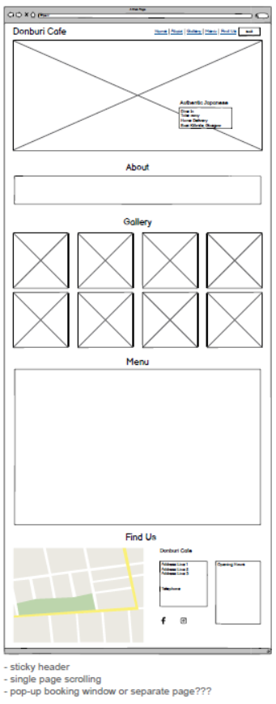
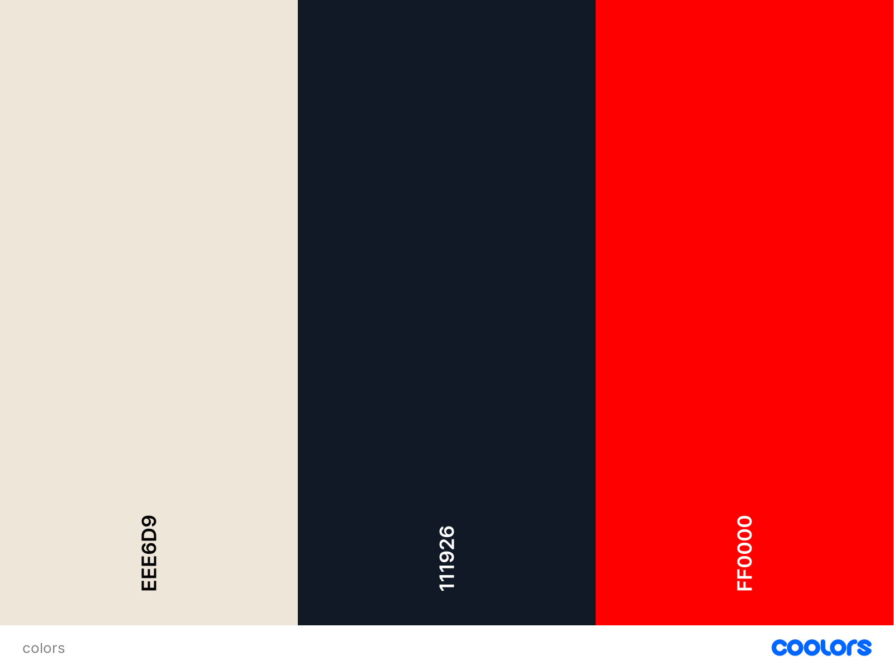
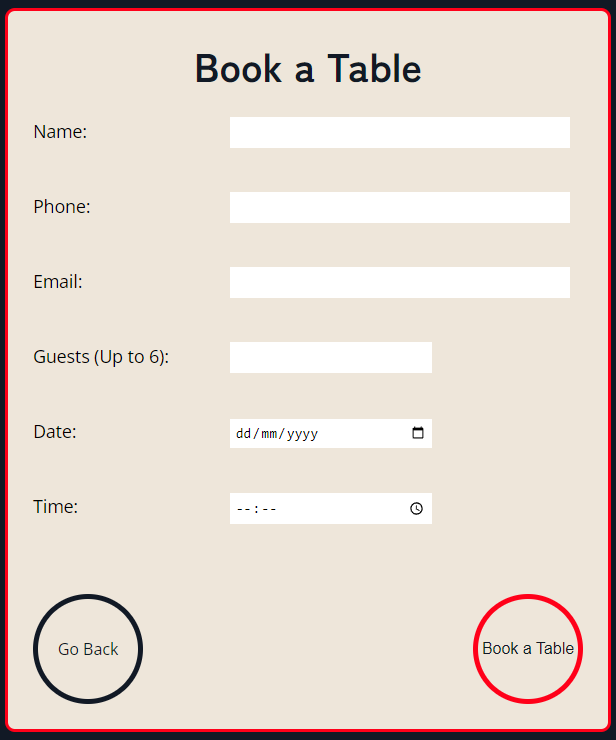
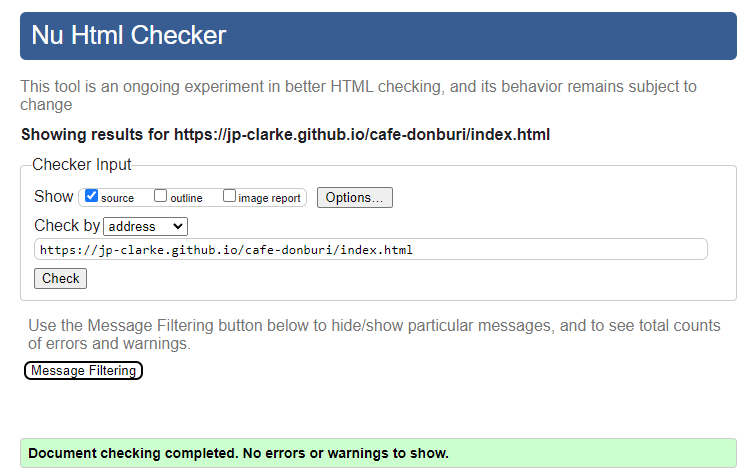
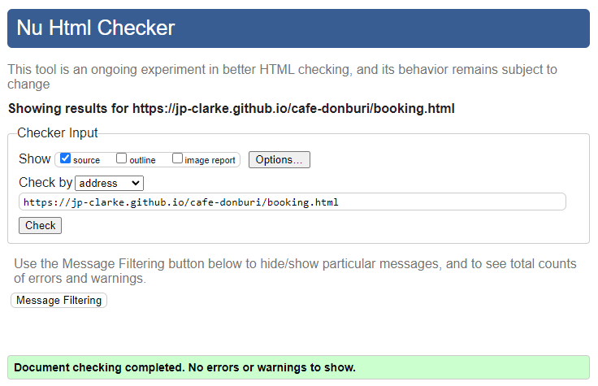
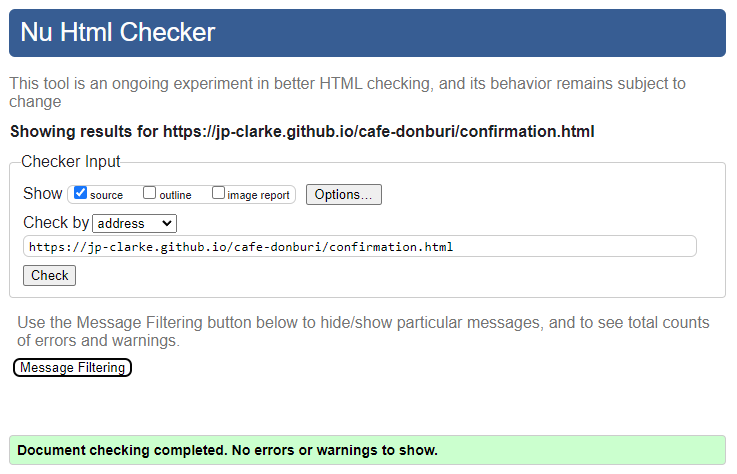
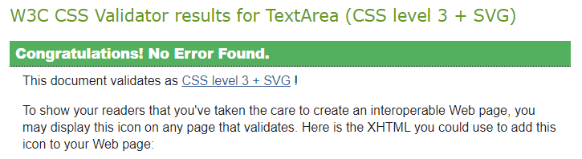
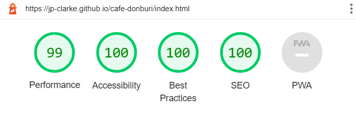
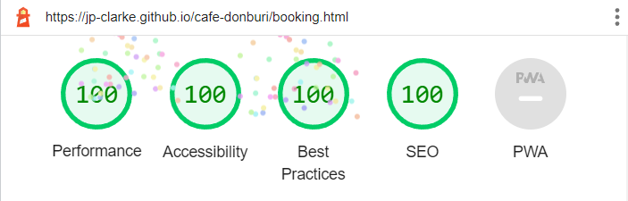
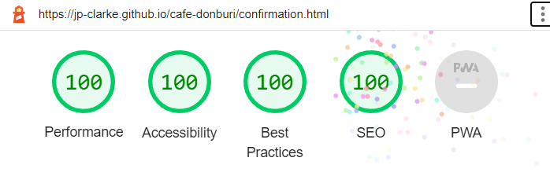

# Cafe Donburi

This is a site for Cafe Donburi, a fictional Japanese Cafe and Takeaway located in East Kilbride, Glasgow.

The site is targeted to locals and visitors to the area to encourage them to try traditional Japanese dishes either dining in or takeaway, as well as allowing both new and returning customers to view pictures some of the available dishes, the menu and make table reservations. It will also help customers locate and contact Cafe Donburi.

## Design

### Wireframe

The intention from the beginning was to create a single page scrolling site with a sticky header. The layout would be kept simple and would require minimal changes from desktop down to mobile screens. For this reason a single wireframe was designed in Balsamiq which would then be applied across all screen sizes.

### Typography

The font for the headings is "Zen Kaku Gothic New", selected as it is a Japanese font. It was paired with "Open Sans". Both come from Google Fonts and are stylish and easy on the eye.

### Color Scheme

The color scheme begins with the header. The background color is Japanese White (#EEE6D9), which is contrasted with its inverse color, Eerie Black (#111926). This is used for the header text. The body of the page reverses these colors, with the text in Japanese White and background in Eerie Black. Red is used in places as it it both eye catching and a color associated with Japan.

## Features

The home page contains almost all of the content and is in the style of a single page scrolling website. It has a sticky header to allow for user friendly navigation between sections.

There is a separate page with a form for table bookings along with a booking confirmation page which consists of a confirmation message and home button.

### Navigation Bar

- The Navigation Bar includes links to the Logo/Home, as well as the About, Gallery, Menu and Find Us sections of the page. Smooth scrolling is employed to allow a smooth transition between the various page sections. Book links to a form in a separate window, which allows the user to make a table reservation.

- The Navigation Bar is fully responsive and switches to a hamburger style menu at smaller screen sizes.

- The Navigation Bar is 'sticky', and remains visible to the user at all times to make navigation easier for the user.

- In large screen format the links are highlighted in a red circle on mouse hover to catch the user's eye, as well as keeping with the Japanese theme.

### Landing

- The landing consists of a hero image of Cafe Donburi's speciality dish with text overlay.

- The text overlay is set in a red circle and establishes the Japanese theme, dining options and location to the user.

### About section

- The About section gives the user an introduction to Cafe Donburi.

- In this section the user is given important pieces of information, including food speciality, location, link for booking a table and phone number for takeaway and home delivery.

### Gallery section

- The Gallery section showcases some of the highlights of the food on offer at Cafe Donburi.

- The user can see the type of food on offer and the appearance of specific dishes and drinks.

### Menu section

- The Menu section gives a comprehensive list of the food and drink on offer at Cafe Donburi.

- The user can see everything that's available to order for takeaway and home delivery.

- If dining in, the user can view what's available in advance.

### Find Us section

- As this is a single page scrolling site, the Find Us section forms the footer of the page.

- This section contains a map showing the location of Cafe Donburi, address, phone number, opening hours and social media links.

- The user is given all necessary information to visit or contact Cafe Donburi in this section.

### Booking section

- The Booking section is on a separate page with all other information removed.

- The user can fill out the form to make a table reservation or return to the home page using the 'Go Back' button.

### Confirmation section

- The Confirmation section is on a separate page with all other information removed.

- This simply lets the user know that the booking form has been successfully completed and return to the home page using the 'Home' button.

### Features to be implemented

- The Booking section was intended to be a popup form on the home page, which would appear when the link was clicked. Once the form was filled out and submitted, the popup would return a confirmation message and allow the user to return to the home page. Currently, the Booking section is a separate page from which the user must navigate back to the home page.
- The form for booking a table contains inputs for date and time which are currently not restricted. In future, these should should be constrained by the opening days/hours of the Cafe.

## Testing

- This site has been tested on the following browsers:
    - Chrome
    - Safari
    - Edge
    - Firefox
    - Opera

- Testing consisted of the following:
    - Loading the home page.
    - Visual inspection of the header, navigation and all sections of the page to ensure that the layout is as expected.
    - Test all links in the navigation bar for functionality and to ensure smooth scrolling between sections.
    - Navigate to booking page to repeat visual inspection of layout.
    - Test booking form works as expected, including back and submit buttons, using https://formdump.codeinstitute.net/
    - Navigate to confirmation page to repeat visual inspection of layout.
    - Use Home button to return to home page.

- Responsive design testing consisted of the following:
    - Responsive design was tested on all pages, primarily using Chrome DevTools across standard screen sizes from desktop (1920x1080) down to small mobile (320x480).
    - Transitions between all media query breakpoints were observed.
    - Testing was also conducted on several available hardware devices within the above range of screen sizes.

### Fixed Bugs

- When implementing the hamburger menu for smaller screen sizes, the font awesome icon was blocking the drop-down menu button and preventing it from being clicked. Researching the issue led to a post on Stack Overflow (link can be found in the credits section) which suggested setting the pointer-events property to none in CSS. This solved the issue.

- On loading the home page initially, the scrolling triggered by navigating to other sections on the page was not smooth. The scrolling became smooth after the first one to two clicks. It was suspected that this was being caused by excessive image sizes. Having applied proper sizing to the images, the problem seems to have disappeared. This has also dramatically improved the performance (see Accessibility section)

- On an iPad running an older version of Safari, the navigation bar was not acting as a sticky element. It was discovered that the developer had forgotten to add the -webkit- prefix to the sticky value, as required by Safari. When this was added, the issue was rectified (link showing how to apply position:sticky; to the header can be found in the credits section).

### Unfixed Bugs

- The Booking form allows the user to input dates and times which are outwith opening hours and/or in the past. There is also nothing preventing overbooking as there is no constraint on capacity at any given time. Research suggests that javascript is required to rectify these issues. Due to a lack of experience in the use of javascript, this was not attempted.

### Validator Testing

#### HTML

- No errors returned when checking code with the official W3C validator.

- Homepage

- Booking page

- Confirmation page

#### CSS

- No errors returned when checking code with the official W3C CSS validator.

#### Accessibility

- All pages were tested for accessibility using Lighthouse in Chrome DevTools, along with performance, best practices and SEO.

- Homepage

- Booking page

- Confirmation page

## Deployment

The site was deployed using Github Pages as follows:
- In the GitHub repository, go to settings.
- Navigate to the Pages section.
- Select Deploy from a branch from the Source drop-down menu.
- Select main from the Branch drop-down menu.
- Select /(root) from the Folder drop-down menu, and save.

The live link for the site is:
https://jp-clarke.github.io/cafe-donburi/index.html

## Credits

### Content

- The following page was used for the hamburger menu on smaller screens, and modified to suit:
https://www.w3schools.com/howto/howto_js_dropdown.asp

- Hamburger menu and social media link icons from font awesome.

- The Love Running walkthrough project by Code Institute was used as a starting point for various sections, in particular the Landing and Gallery, as well as the section for social media links and Booking form.

- Google map in Find Us section was added using the following link as a guide:
https://blog.duda.co/responsive-google-maps-for-your-website

- Smooth scrolling code:
https://www.w3schools.com/howto/tryit.asp?filename=tryhow_css_js_dropdown

- Sticky header code:
https://www.w3schools.com/howto/howto_css_sticky_element.asp

- Scroll margin code:
https://www.w3schools.com/cssref/css_pr_scroll-margin-top.php

- The following link was used to solve the issue of the hamburger icon blocking the button below from being clicked:
https://stackoverflow.com/questions/36927140/cant-click-the-button-because-of-the-overlay

### Images

- The hero image (hero-shot.png) was taken from https://www.canva.com/

- The following images were taken from https://www.pexels.com/
    - sushi2.jpg
    - tempura-don.jpg

- The following images were taken from https://pixabay.com/
    - coffee-matcha-latte.jpg
    - donburi.jpg
    - gyudon.jpg

- The following images were taken from https://unsplash.com/
    - gyoza-noodles.jpg
    - ramen1.jpg
    - ramen2.jpg
    - sushi1.jpg
    - teriyaki-chicken.jpg

- The following images are the developer's own
    - katsu-curry.jpg
    - maki-sushi.jpg

### Acknowledgements

- I'd like to thank my mentor, Jubril Akolade for his guidance and support so far.
- Thank you to the Code Institute Slack Community for the wealth of additional resources provided.